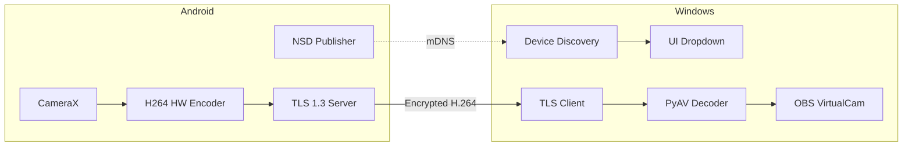

# VanCamera Architecture

## Overview

VanCamera is a secure, low-latency system that turns an Android phone into a high-quality webcam for Windows. The Android device acts as a TLS server that captures, encodes, and streams video. Windows acts as a client that discovers devices, decodes video, and feeds it to a virtual camera.

```
┌─────────────────────┐         TLS 1.3          ┌─────────────────────┐
│      Android        │ ──────────────────────▶  │      Windows        │
│  (Camera + Server)  │      H.264 Stream        │  (Client + VCam)    │
└─────────────────────┘                          └─────────────────────┘
```

## System Diagram



## Components

### Android Components

| Component | File | Purpose |
|-----------|------|---------|
| CameraManager | `CameraManager.kt` | CameraX initialization and frame capture |
| H264Encoder | `H264Encoder.kt` | Hardware H.264 encoding via MediaCodec |
| VideoStreamer | `VideoStreamer.kt` | TLS 1.3 server, sends encoded frames |
| NsdServicePublisher | `NsdServicePublisher.kt` | mDNS service advertisement |
| CertificateManager | `CertificateManager.kt` | TLS certificate generation |

### Windows Components

| Component | File | Purpose |
|-----------|------|---------|
| DeviceDiscovery | `device_discovery.py` | USB polling + mDNS listener |
| VideoReceiver | `video_receiver.py` | TLS client, receives H.264 stream |
| PyAV Decoder | `video_receiver.py` | H.264 to RGB frame conversion |
| VirtualCamBridge | `virtual_cam_bridge.py` | Feeds frames to OBS-VirtualCam |
| UI | `ui_app.py` | CustomTkinter interface |

## Data Flow

```
1. CameraX captures YUV frame
2. H264Encoder converts to H.264 NAL units (hardware)
3. VideoStreamer wraps in packet: [size][flags][data]
4. TLS encrypts and sends over TCP
5. VideoReceiver decrypts and unwraps packet
6. PyAV decodes H.264 to RGB numpy array
7. Frame is rotated based on orientation flags
8. VirtualCamBridge sends to OBS-VirtualCam
9. Applications (Discord, Zoom) see OBS-Camera
```

## Device Discovery

VanCamera supports two discovery methods:

| Method | How it works | Latency |
|--------|--------------|---------|
| USB | Windows polls `adb devices` every 2s | Instant |
| WiFi | Android publishes `_vancamera._tcp` mDNS service | 2-5 seconds |

See [CONNECTION_USB.md](CONNECTION_USB.md) and [CONNECTION_WIFI.md](CONNECTION_WIFI.md) for details.

## Security

- All video traffic encrypted with TLS 1.3
- Self-signed certificates generated on first run
- No plaintext video ever leaves the device
- Safe for use on public networks (university, coffee shop)
