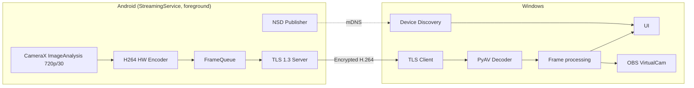

# VanCamera Architecture

## Overview

VanCamera is a secure, low-latency system that turns an Android phone into a high-quality webcam for Windows. The Android device acts as a TLS server that captures, encodes, and streams video. Windows acts as a client that discovers devices, decodes video, and feeds it to a virtual camera.

```
┌─────────────────────┐         TLS 1.3          ┌─────────────────────┐
│      Android        │ ──────────────────────▶  │      Windows        │
│  (Camera + Server)  │      H.264 Stream        │  (Client + VCam)    │
└─────────────────────┘                          └─────────────────────┘
```

## System Diagram


```mermaid
flowchart LR
    subgraph Android["Android (StreamingService, foreground)"]
        CAM[CameraX ImageAnalysis 720p/30] --> ENC[H264 HW Encoder]
        ENC --> Q[FrameQueue]
        Q --> TLS[TLS 1.3 Server]
        NSD[NSD Publisher]
    end

    subgraph Windows
        DISC[Device Discovery] --> UI[UI]
        CLIENT[TLS Client] --> DEC[PyAV Decoder]
        DEC --> PROC[Frame processing]
        PROC --> VCAM[OBS VirtualCam]
        PROC --> UI
    end

    TLS -->|"Encrypted H.264"| CLIENT
    NSD -.->|"mDNS"| DISC
```

## Components

### Android Components

| Component | File | Purpose |
|-----------|------|---------|
| StreamingService | `StreamingService.kt` | Camera foreground service that owns camera, encoder and server; keeps streaming with the screen off or the app closed |
| MainActivity | `MainActivity.kt` | Remote control for the service: preview, status, IP addresses, start/stop |
| CameraManager | `CameraManager.kt` | CameraX binding; only binds the use cases that are needed right now |
| YuvConverter | `YuvConverter.kt` | Fast YUV_420_888 → NV12/I420 copy (bulk row copies) |
| H264Encoder | `H264Encoder.kt` | Hardware H.264 encoding via MediaCodec (async mode) |
| FrameQueue | `FrameQueue.kt` | Bounded send queue; drops frames and requests a keyframe when the network is slow |
| FrameRateLimiter | `FrameRateLimiter.kt` | Caps processing at 30 fps; picks the camera FPS range |
| VideoStreamer | `VideoStreamer.kt` | TLS 1.3 server; accept loop, one sender thread per client |
| NsdServicePublisher | `NsdServicePublisher.kt` | mDNS service advertisement (with a stable device id) |
| NetworkAddresses | `NetworkAddresses.kt` | Lists the phone's IPs so they can be typed on the PC |
| CertificateManager | `CertificateManager.kt` | TLS certificate generation |

### Windows Components

| Component | File | Purpose |
|-----------|------|---------|
| DeviceDiscovery | `device_discovery.py` | USB polling + mDNS listener + manually added devices |
| ADB helpers | `adb_forward.py` | Finds `adb` (bundled copy first) and sets up `adb forward` |
| VideoReceiver | `video_receiver.py` | TLS client, receives and decodes H.264, detects stalls |
| StreamController | `stream_controller.py` | Session lifecycle, auto-reconnect, frame processing thread |
| Frame transforms | `frame_transform.py` | Orientation / mirroring / resize helpers |
| VirtualCamBridge | `virtual_cam_bridge.py` | Feeds frames to OBS-VirtualCam |
| UI | `ui_app.py` | CustomTkinter interface (never touched from background threads) |

## Data Flow

```
1. CameraX delivers a 720p YUV frame (capped at 30 fps)
2. YuvConverter copies it straight into a MediaCodec input buffer
3. H264Encoder produces H.264 NAL units (hardware); SPS/PPS prepended to keyframes
4. VideoStreamer wraps them in a packet: [size][flags][data] and queues it
5. The sender thread writes packets over TLS (one TLS record per frame)
6. VideoReceiver decrypts, unwraps and decodes every packet (PyAV)
7. The newest decoded frame is handed to the processing thread (older ones are skipped)
8. Frame is rotated based on orientation flags
9. VirtualCamBridge sends it to OBS-VirtualCam; the UI polls a downscaled preview
10. Applications (Discord, Zoom) see OBS-Camera
```

## Android Lifecycle and Power

| Situation | Camera | Encoder | Locks |
|-----------|--------|---------|-------|
| App open, not streaming | Preview only (if enabled) | Off | None |
| Streaming, waiting for the PC | Preview only (if app visible) | Off | Multicast (mDNS) |
| PC connected, app visible | Preview + analysis | On | Wake lock + Wi-Fi low-latency lock |
| PC connected, screen off / app closed | Analysis only | On | Wake lock + Wi-Fi low-latency lock |

The service becomes a *camera foreground service* when the user taps Start, so Android lets it
keep the camera after the screen turns off or the activity is closed. A notification shows the
state and has **Switch camera** and **Stop** actions.

## Windows Threads

| Thread | Work |
|--------|------|
| Tk main loop | Widgets only; drains an event queue and polls the preview |
| `usb-poll` | `adb devices` every 2 s |
| zeroconf | mDNS browsing |
| `stream-worker` | Connect / wait / reconnect with backoff |
| `video-receive` | Read + decode every packet, hand over the newest frame |
| `frame-process` | Rotate, send to the virtual camera, prepare the preview |

## Device Discovery

VanCamera supports two discovery methods:

| Method | How it works | Latency |
|--------|--------------|---------|
| USB | Windows polls `adb devices` every 2s | Instant |
| WiFi | Android publishes `_vancamera._tcp` mDNS service | 2-5 seconds |
| Manual | User types the IP shown on the phone ("Add by IP…") | Instant |

See [CONNECTION_USB.md](CONNECTION_USB.md) and [CONNECTION_WIFI.md](CONNECTION_WIFI.md) for details.

## Security

- All video traffic encrypted with TLS 1.3
- Self-signed certificates generated on first run
- No plaintext video ever leaves the device
- Safe for use on public networks (university, coffee shop)
