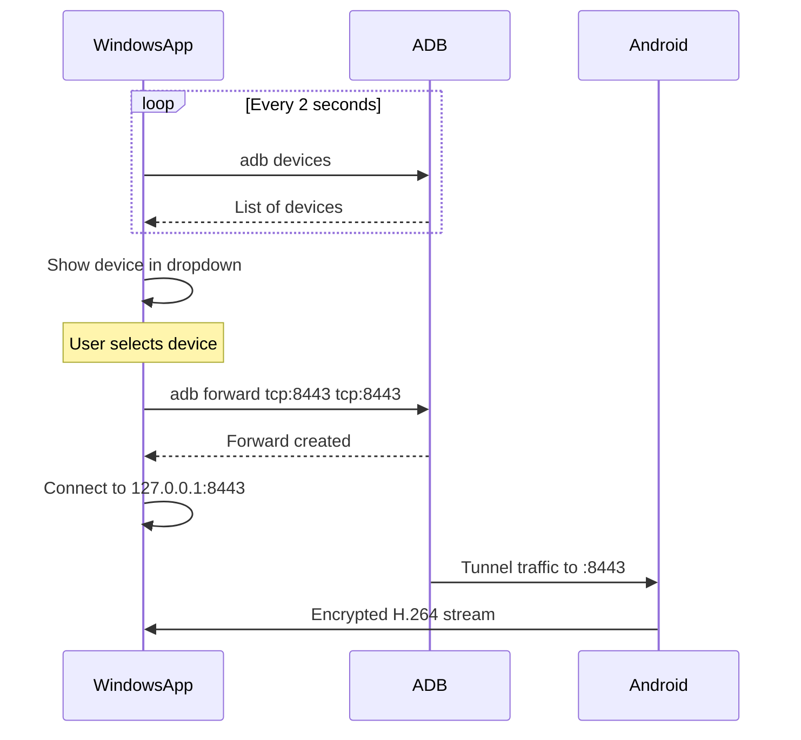

# USB Connection

## Overview

USB mode provides the lowest latency and most reliable connection. It uses ADB (Android Debug Bridge) to create a TCP tunnel over the USB cable.

## How It Works



## ADB Port Forwarding

```
┌─────────────────┐      ┌─────────────────┐      ┌─────────────────┐
│  Windows App    │      │    USB Cable    │      │     Android     │
│                 │      │                 │      │                 │
│ Connect to      │      │   ADB Tunnel    │      │  TLS Server     │
│ 127.0.0.1:8443 ─┼─────▶│ tcp:8443 ──────▶│─────▶│  :8443          │
│                 │      │                 │      │                 │
└─────────────────┘      └─────────────────┘      └─────────────────┘
```

## Why 127.0.0.1?

- ADB creates a local port that tunnels to Android
- Windows connects to `localhost:8443`
- ADB forwards all traffic through USB
- No need to know Android's actual IP

## Requirements

| Requirement | Details |
|-------------|---------|
| USB cable | Must be data-capable (not charge-only) |
| USB Debugging | Enabled in Developer Options |
| ADB | Installed and in PATH |

## Setup ADB

1. Download [Android SDK Platform Tools](https://developer.android.com/studio/releases/platform-tools)
2. Extract to a folder (e.g., `C:\platform-tools`)
3. Add to PATH environment variable
4. Verify: `adb version`

## Enable USB Debugging

1. Settings → About Phone
2. Tap "Build Number" 7 times
3. Settings → Developer Options
4. Enable "USB Debugging"
5. Connect phone and accept the prompt

## Pros and Cons

| Pros | Cons |
|------|------|
| Lowest latency | Requires cable |
| Most reliable | Phone stays tethered |
| Works anywhere | One device at a time |
| No network needed | Requires ADB setup |
| Always works | - |

## Troubleshooting

| Problem | Solution |
|---------|----------|
| "No devices found" | Check USB cable is data-capable |
| "unauthorized" | Accept USB debugging prompt on phone |
| ADB not found | Add platform-tools to PATH |
| Port forward fails | Restart ADB: `adb kill-server` |
