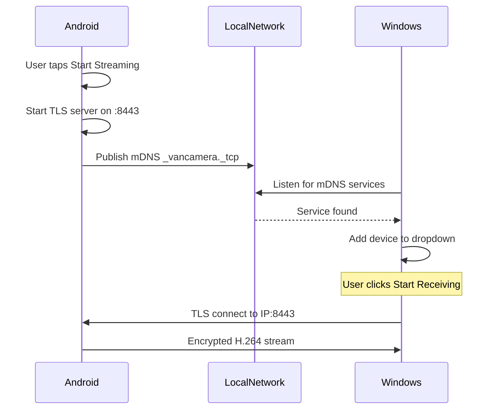

# WiFi Connection

## Overview

WiFi mode allows wireless streaming between Android and Windows on the same local network. Android publishes an mDNS service that Windows discovers automatically.

## How It Works



## Network Topology

```
┌─────────────────────────────────────────────────────┐
│                  Local WiFi Network                 │
│                                                     │
│    ┌──────────────┐          ┌──────────────┐      │
│    │   Android    │          │   Windows    │      │
│    │ 192.168.1.50 │◀────────▶│ 192.168.1.100│      │
│    │    :8443     │  TLS 1.3 │              │      │
│    └──────────────┘          └──────────────┘      │
│                                                     │
└─────────────────────────────────────────────────────┘
```

## Requirements

| Requirement | Details |
|-------------|---------|
| Same network | Both devices on same WiFi / subnet |
| mDNS | Not blocked by router (most allow it) |
| Port 8443 | Not blocked by firewall |

## Discovery

1. Android starts streaming → publishes `_vancamera._tcp.local.`
2. Windows Zeroconf listener detects the service
3. Device appears in dropdown with IP address
4. User selects and clicks "Start Receiving"

## Pros and Cons

| Pros | Cons |
|------|------|
| Wireless freedom | Depends on WiFi quality |
| Move around room | Higher latency than USB |
| No cable needed | mDNS may fail on corporate networks |
| Multiple devices | Requires same network |

## Troubleshooting

| Problem | Solution |
|---------|----------|
| Device not appearing | Check same WiFi network |
| mDNS blocked | Use USB connection instead |
| High latency | Move closer to router |
| Connection drops | Check WiFi signal strength |
