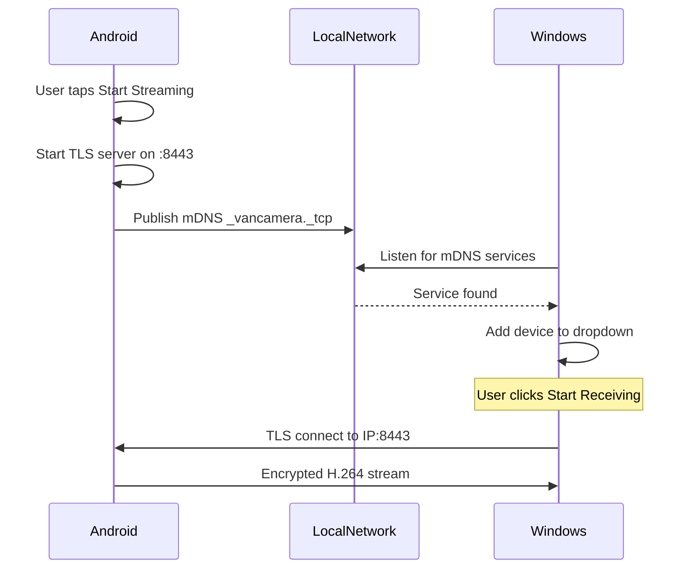

# WiFi Connection

## Overview

WiFi mode allows wireless streaming between Android and Windows on the same local network. Android publishes an mDNS service that Windows discovers automatically.

## How It Works


```mermaid
sequenceDiagram
    participant A as Android
    participant N as LocalNetwork
    participant W as Windows

    A->>A: User taps Start Streaming
    A->>A: Start TLS server on :8443
    A->>N: Publish mDNS _vancamera._tcp
    W->>N: Listen for mDNS services
    N-->>W: Service found
    W->>W: Add device to dropdown
    Note over W: User clicks Start Receiving
    W->>A: TLS connect to IP:8443
    A->>W: Encrypted H.264 stream
```

## Network Topology

```
┌─────────────────────────────────────────────────────┐
│                  Local WiFi Network                 │
│                                                     │
│    ┌──────────────┐          ┌──────────────┐      │
│    │   Android    │          │   Windows    │      │
│    │ 192.168.1.50 │◀────────▶│ 192.168.1.100│      │
│    │    :8443     │  TLS 1.3 │              │      │
│    └──────────────┘          └──────────────┘      │
│                                                     │
└─────────────────────────────────────────────────────┘
```

## Requirements

| Requirement | Details |
|-------------|---------|
| Same network | Both devices on same WiFi / subnet |
| mDNS | Not blocked by router (most home routers allow it); otherwise use manual IP |
| Port 8443 | Not blocked by firewall |

## Discovery

1. Android starts streaming → publishes `_vancamera._tcp.local.`
2. Windows Zeroconf listener detects the service
3. Device appears in dropdown with IP address
4. User selects and clicks "Start Receiving"

## Manual IP (enterprise / university networks)

Many managed networks (corporate Wi-Fi, eduroam, hotels) filter multicast, so mDNS discovery
never sees the phone. You can still connect directly:

1. Tap **Start streaming** on the phone. The status card shows its address, e.g.
   `Wi-Fi: 10.20.30.40:8443`.
2. In the Windows app click **Add by IP…** and type that address.
3. Click **Connect**. The phone is remembered for next time (use **Forget** to remove it).

If the manual connection also times out, the network isolates clients from each other
("AP/client isolation"): devices on it cannot talk to each other at all. Use one of:

| Alternative | How |
|-------------|-----|
| USB | Always works, no network involved |
| Phone hotspot | Connect the PC to the phone's hotspot and use the *Hotspot* address shown on the phone |
| PC hotspot | Windows *Mobile hotspot*, connect the phone to it |

## Staying Connected

- While a PC is connected the phone holds a Wi-Fi low-latency lock, so Wi-Fi power saving does
  not batch packets (a cause of multi-second freezes).
- If the network is too slow, the phone drops frames instead of queueing them, so the delay does
  not keep growing.
- If the link goes silent for 5 s, Windows reconnects automatically (toggle *Auto-reconnect*).
  The phone accepts the new connection without restarting the stream.

## Pros and Cons

| Pros | Cons |
|------|------|
| Wireless freedom | Depends on WiFi quality |
| Move around room | Higher latency than USB |
| No cable needed | Discovery may be blocked on corporate networks (use Add by IP) |
| Multiple devices | Requires a network that lets devices talk to each other |

## Troubleshooting

| Problem | Solution |
|---------|----------|
| Device not appearing | Check same WiFi network, or use **Add by IP…** |
| mDNS blocked | Use **Add by IP…** with the address shown on the phone |
| Manual IP times out | Network isolates clients: use USB or a hotspot |
| High latency | Move closer to router, or use USB |
| Connection drops | Leave *Auto-reconnect* on; check WiFi signal strength |
