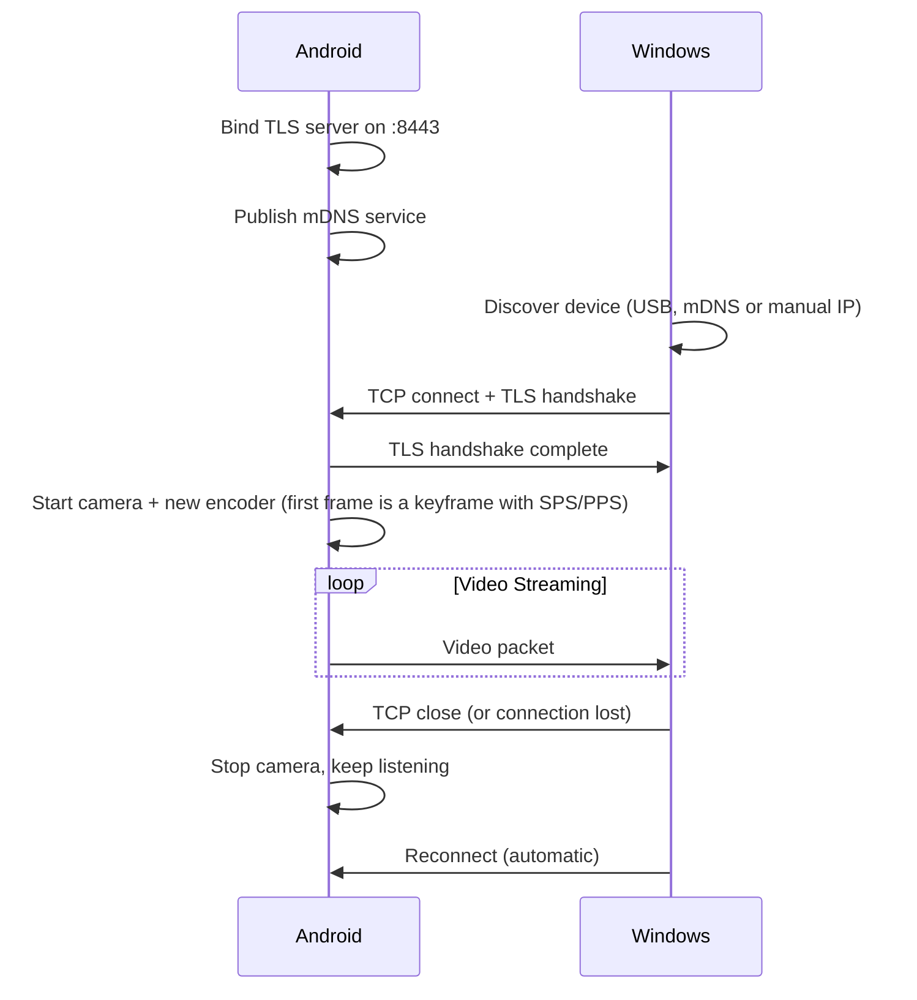

# VanCamera Protocol Specification

## Overview

VanCamera uses a simple framed protocol over TLS 1.3 TCP connections.

## Connection Flow


```mermaid
sequenceDiagram
    participant A as Android
    participant W as Windows

    A->>A: Bind TLS server on :8443
    A->>A: Publish mDNS service
    W->>W: Discover device (USB, mDNS or manual IP)
    W->>A: TCP connect + TLS handshake
    A->>W: TLS handshake complete
    A->>A: Start camera + new encoder (first frame is a keyframe with SPS/PPS)
    loop Video Streaming
        A->>W: Video packet
    end
    W->>A: TCP close (or connection lost)
    A->>A: Stop camera, keep listening
    W->>A: Reconnect (automatic)
```

### Server behavior (Android)

- The server keeps accepting connections for as long as streaming is on. A new client that
  completes the TLS handshake **replaces** the current one (typical after a Wi-Fi drop, when the
  old TCP connection is half-open).
- Connections that fail the TLS handshake within 5 s are closed and ignored (port scanners,
  security probes on enterprise networks), so they no longer end the stream.
- Every new client gets a fresh encoder, so the first packet is always a keyframe with SPS/PPS.
- Packets go through a bounded queue (~200 ms). When the network cannot keep up, queued frames
  are dropped and the encoder is asked for a keyframe; the receiver sees a short skip instead of
  growing latency.
- A write blocked for more than 5 s drops the client.

### Client behavior (Windows)

- No data for 5 s means the link is dead: the client disconnects and reconnects (with backoff
  1, 2, 3, 5 s) while "Auto-reconnect" is on. The virtual camera stays open meanwhile.
- A packet size of 0-1 or larger than 8 MB is treated as a protocol error.

## Packet Format

Each video frame is sent as a single packet:

```
┌─────────────────┬─────────────────┬─────────────────────────┐
│   Size (4B)     │   Flags (1B)    │      H.264 Payload      │
│   Big-endian    │   See below     │      NAL units          │
└─────────────────┴─────────────────┴─────────────────────────┘
```

### Size Field (4 bytes)

- Big-endian unsigned integer
- Value = 1 (flags) + length of H.264 data
- Does NOT include the size field itself

### Flags Field (1 byte)

```
Bit 7   Bit 6   Bit 5   Bit 4   Bit 3   Bit 2   Bit 1   Bit 0
┌───────┬───────┬───────┬───────┬───────┬───────┬───────┬───────┐
│ Back  │   -   │   -   │   -   │   -   │   -   │ Ori   │ Ori   │
│ Cam   │       │       │       │       │       │ [1]   │ [0]   │
└───────┴───────┴───────┴───────┴───────┴───────┴───────┴───────┘
```

| Bits | Name | Values |
|------|------|--------|
| 0-1 | Orientation | 0=0°, 1=90°, 2=180°, 3=270° |
| 7 | Back Camera | 0=front camera, 1=back camera |
| 2-6 | Reserved | Must be 0 |

### H.264 Payload

- Raw H.264 NAL units
- Includes SPS/PPS in keyframes
- Baseline or Main profile
- Typical bitrate: 2-4 Mbps

## mDNS Service

When streaming starts, Android publishes:

| Property | Value |
|----------|-------|
| Service Type | `_vancamera._tcp.local.` |
| Service Name | `VanCamera-<DeviceModel>` |
| Port | 8443 (default) |
| TXT `id` | Stable random id of this app install |
| TXT `model` | Device model |

Example: `VanCamera-Pixel_8_Pro._vancamera._tcp.local.`

Android may rename the service (`VanCamera-Pixel_8_Pro (2)`) if an old registration is still
cached on the network. Windows therefore identifies a phone by its TXT `id` (or by IP:port for
older app versions), never by the service name, so the same phone is only listed once.

## Port

Default port: **8443**

For USB connections, ADB forwards this port (for the selected phone):
```
adb -s <serial> forward tcp:8443 tcp:8443
```

## TLS Configuration

| Setting | Value |
|---------|-------|
| Protocol | TLS 1.3 only |
| Certificate | Self-signed, generated on first run |
| Client Auth | Not required |
