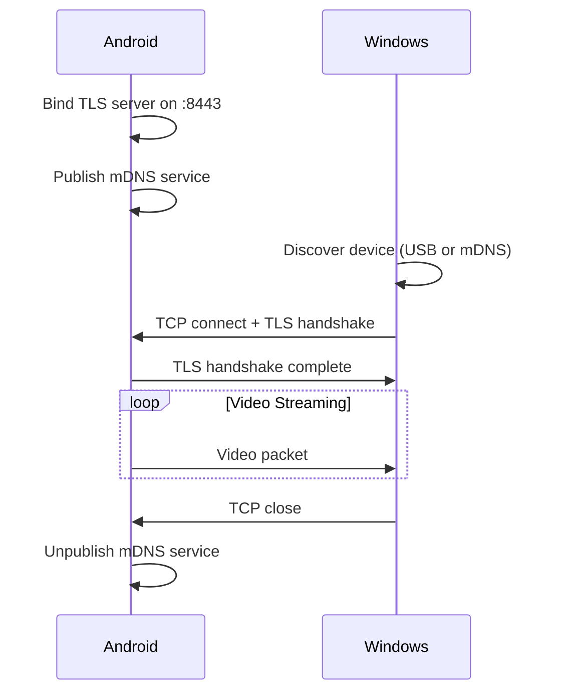

# VanCamera Protocol Specification

## Overview

VanCamera uses a simple framed protocol over TLS 1.3 TCP connections.

## Connection Flow



## Packet Format

Each video frame is sent as a single packet:

```
┌─────────────────┬─────────────────┬─────────────────────────┐
│   Size (4B)     │   Flags (1B)    │      H.264 Payload      │
│   Big-endian    │   See below     │      NAL units          │
└─────────────────┴─────────────────┴─────────────────────────┘
```

### Size Field (4 bytes)

- Big-endian unsigned integer
- Value = 1 (flags) + length of H.264 data
- Does NOT include the size field itself

### Flags Field (1 byte)

```
Bit 7   Bit 6   Bit 5   Bit 4   Bit 3   Bit 2   Bit 1   Bit 0
┌───────┬───────┬───────┬───────┬───────┬───────┬───────┬───────┐
│ Back  │   -   │   -   │   -   │   -   │   -   │ Ori   │ Ori   │
│ Cam   │       │       │       │       │       │ [1]   │ [0]   │
└───────┴───────┴───────┴───────┴───────┴───────┴───────┴───────┘
```

| Bits | Name | Values |
|------|------|--------|
| 0-1 | Orientation | 0=0°, 1=90°, 2=180°, 3=270° |
| 7 | Back Camera | 0=front camera, 1=back camera |
| 2-6 | Reserved | Must be 0 |

### H.264 Payload

- Raw H.264 NAL units
- Includes SPS/PPS in keyframes
- Baseline or Main profile
- Typical bitrate: 2-4 Mbps

## mDNS Service

When streaming starts, Android publishes:

| Property | Value |
|----------|-------|
| Service Type | `_vancamera._tcp.local.` |
| Service Name | `VanCamera-<DeviceModel>` |
| Port | 8443 (default) |

Example: `VanCamera-Pixel_8_Pro._vancamera._tcp.local.`

## Port

Default port: **8443**

For USB connections, ADB forwards this port:
```
adb forward tcp:8443 tcp:8443
```

## TLS Configuration

| Setting | Value |
|---------|-------|
| Protocol | TLS 1.3 only |
| Certificate | Self-signed, generated on first run |
| Client Auth | Not required |
